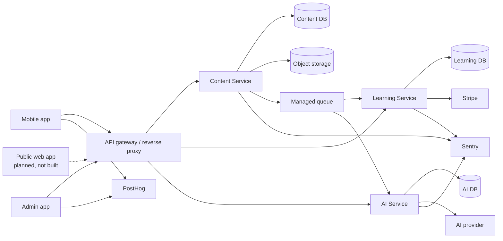

# System overview

The system is a monorepo with independent deployment units. Service and database boundaries follow [ADR-001](../decisions/ADR-001-service-boundaries.md) and [ADR-002](../decisions/ADR-002-database-ownership.md).

## Components

Mobile is the first learner client; admin supports editors and reviewers. The public web client is a future option only. A managed gateway terminates public traffic, applies coarse routing/rate limits, and forwards identity context. Each service enforces its own authorization.

Content Service holds editorial truth and emits immutable snapshots through object storage plus release events through a managed queue. Learning Service imports snapshots into a local projection and serves learner interactions without synchronous Content Service calls. AI Service executes constrained synchronous transformations and queued long-running content jobs. PostgreSQL databases are separate. Stripe handles payments; PostHog receives minimized analytics; Sentry receives scrubbed diagnostics.

## Main flows

1. **Admin:** Admin → gateway → Content Service for authoring/review/publishing; selected AI draft jobs go to AI Service and return as unapproved proposals.
2. **Practice/mock:** Mobile → gateway → Learning Service; the service reads its local content projection, pins a release, records answers, and calculates results.
3. **Subscription:** Mobile begins a provider flow; Learning Service verifies provider webhooks and derives entitlements.
4. **Publishing:** Content Service writes a checksummed snapshot to object storage and emits a release event; Learning Service imports it idempotently.
5. **AI jobs:** A service enqueues a minimal, policy-approved request; AI Service processes it, stores provenance, and reports success/failure without changing canonical data.

External outages must degrade the related capability rather than violate ownership. See [publishing flow](content-publishing-flow.md), [security](security-and-privacy.md), and service-specific documents.

