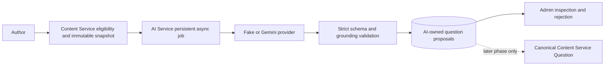

# Phase 2A.1 — AI question-generation foundation

Phase 2A.1 adds persistent, knowledge-first question proposals. AI-generated questions are editorial proposals only. They are not canonical Questions and are never automatically submitted, approved, published, or released.

## Architecture and ownership

Content Service remains the authority for Knowledge Facts, Sources, hierarchy, and canonical Questions. AI Service owns jobs and derived proposals. The browser calls Content Service only; provider credentials and immutable snapshot construction remain server-side.

## Knowledge-first eligibility

Generation accepts one current Knowledge Fact that is both `APPROVED` and `ACTIVE`, has a valid current version, belongs to a non-archived hierarchy, passes deterministic fact-text validation, and has linked non-retired Sources with stored content. Draft, under-review, rejected, requires-update, retired, missing, invalid, or stale facts are rejected before provider dispatch.

The platform currently stores no language field on Knowledge Facts. Content Service therefore applies its configured `content.default-language` (`sv` locally) and supports `sv` and `en`. Persisting fact language is deferred to a later content-model migration.

## APIs

- `POST /api/v1/admin/knowledge-facts/{knowledgeFactId}/ai-question-generation-jobs`
- `GET /api/v1/admin/knowledge-facts/{knowledgeFactId}/ai-question-generation-eligibility`
- `GET /api/v1/admin/knowledge-facts/{knowledgeFactId}/ai-question-generation-jobs?limit=10`
- `GET /api/v1/admin/ai/question-generation-jobs/{jobId}`
- `GET /api/v1/admin/ai/question-generation-jobs/{jobId}/proposals`
- `POST /api/v1/admin/ai/question-generation-jobs/{jobId}/cancel`
- `POST /api/v1/admin/ai/question-proposals/{proposalId}/reject`

The internal equivalents live below `/internal/v1/question-generation`. The operation is `GENERATE_QUESTIONS_FROM_FACT`; prompt version is `question-generation-foundation-v1`. Requests allow one to three proposals and an optional existing canonical question type: `SINGLE_CHOICE`, `TRUE_FALSE`, or `MULTIPLE_CHOICE`.

## Lifecycle, safety, and recovery

Jobs reuse `QUEUED`, `RUNNING`, `COMPLETED`, `PARTIALLY_COMPLETED`, `FAILED`, and `CANCELLED`. Proposals use `PROPOSED` and `REJECTED`. Rejection preserves generated content and provenance. There is intentionally no edit or acceptance API.

The provider must return strict structured JSON with a controlled result type: `QUESTIONS_PROPOSED`, `INSUFFICIENT_GROUNDED_INFORMATION`, or `FACT_NOT_SUITABLE_FOR_QUESTION`. Universal validation verifies immutable fact identity/version/checksum, known question type, language, option identity/order/uniqueness, correct-answer cardinality, correct-answer and explanation grounding, and verbatim Source evidence identity/checksum/quote. Invalid proposals fail closed; valid siblings may produce `PARTIALLY_COMPLETED`.

Facts, Source excerpts, and titles are untrusted data. The Gemini system instruction forbids embedded instructions, browsing, tools, prompt disclosure, canonical writes, and workflow decisions. Source context is bounded to 12,000 characters by default. The maximum proposal count is three.

Creation is idempotent per requester and explicit key. Transient provider failures use the existing bounded exponential retry policy. Deterministic validation failures are not retried. Cancellation is idempotent and late provider output is discarded. AI Service verifies stored snapshot hashes before dispatch; Content Service re-checks the current fact version/checksum before proposals can be read or rejected.

Eligibility is derived from the fact's authoritative current version and directly linked Sources; the Admin Source picker and its pagination are not used. Fact-scoped history returns an active job first when present, otherwise the latest terminal job. The Admin workspace recovers that selection after refresh, resumes polling active work, and reloads persistent proposals including rejected proposals.

## Authorization

- `CONTENT_AUTHOR` and `ADMIN` may generate.
- The requesting author, `CONTENT_REVIEWER`, and `ADMIN` may inspect accessible jobs and proposals.
- The requesting author, `CONTENT_REVIEWER`, and `ADMIN` may reject proposals.
- Only the requester or `ADMIN` may cancel.
- Learners have no route or role access.

## Providers

Automated tests use `AI_PROVIDER=FAKE`. The deterministic fake provider supports valid structures, multiple proposals, controlled no-output, prompt/grounding failures, malformed output, timeout, and unavailable-provider markers used by tests.

Gemini uses the configured `AI_GEMINI_MODEL` (locally `gemini-3.1-flash-lite`), strict `responseJsonSchema`, no tools/retrieval, bounded concurrency/timeouts, application quota reservations, provider request IDs, and token metadata. Live Gemini validation is opt-in and must use non-sensitive demo content; ordinary tests never consume provider quota.

## Manual validation

1. Start PostgreSQL, Keycloak, Content Service, AI Service with the fake provider, and Admin Portal.
2. Sign in as a content author and open an approved active Knowledge Fact with stored Source content.
3. In **AI Question Proposals**, select **Generate Questions**, choose one to three proposals and a question type, then generate.
4. Observe queued/running state change without refresh and inspect the completed proposals, options, proposed correct answers, explanation, evidence, and provenance.
5. Reject one proposal with a reason and refresh; confirm it remains visible as rejected.
6. Confirm the Knowledge Fact and canonical Question list are unchanged.
7. Repeat with a draft or retired fact and confirm generation is disabled and rejected server-side.
8. Use deterministic fake markers in dedicated test fixtures to validate insufficient information, malformed output, timeout/retry, stale input, and cancellation.

For optional Gemini validation, set `AI_PROVIDER=GEMINI`, keep the API key server-side, use `AI_GEMINI_MODEL=gemini-3.1-flash-lite`, restart AI Service, and repeat with non-sensitive demo content. Verify structured output, model/provider/token metadata, grounding, and a closed circuit after success.

## Known limitations and Phase 2A.2 deferrals

Phase 2A.1 intentionally does not implement proposal editing, acceptance, canonical Question creation, batch generation, exhaustive distractor scoring, semantic duplicate detection, difficulty calibration, translation, automated review, or any publication/release action. Phase 2A.2 may deepen type-specific and distractor validation without changing the normalized proposal model.

Troubleshooting: an ineligible fact returns a stable `AI_QUESTION_GENERATION_*` error; stale content requires a new job; missing Source content must be added in Content Service; `AI_PROVIDER_NOT_CONFIGURED` means the internal AI connection is absent; transient provider failures remain visible on the job after bounded retries.
